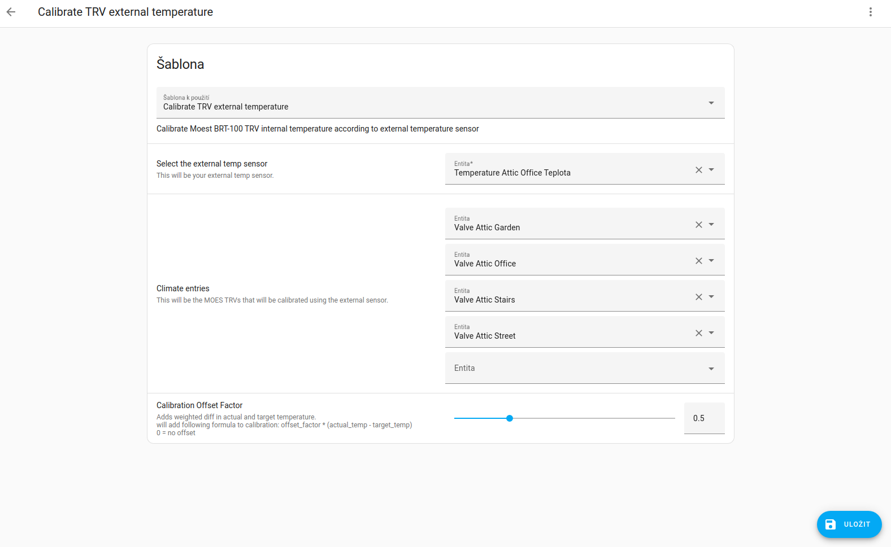

# HAMoesTrvAutomations

My Home Assistant Automations for Moes TRV BRT-100.

## Automations

### Calibrate TRV external temperature

This blueprint uses external temperature sensor readings and updates the local calibration of selected TRVs so it shows the same temperature.

It supports multiple TRVs if you have one room with more of them.

HA can set target temperature only to whole degrees. TRV turns on when it reads temperature less than target, again 
in whole degrees. And turns it off when it is greater by 1 or sometimes even 2 degrees. Imagine following scenario:

- target temp set to 21
- turns on when TRV temp is <= 20
- turns off when TRV temp is >= 23
  - it uses internal, next to radiator, temperature sensor so not accurate too much

With this in mind, the temperature in room usually oscillates +/- 2 degrees, which was really unacceptable to me. 
To address this issue, note the offset_factor parameter in this blueprint.

Parameters:

- external temperature sensor
  - used to read the real room temperature
- list of TRVs
  - TRVs in the same room to be calibrated through local_temperature_calibration property
- offset_factor
    - This adds another offset to calculated calibration
        - calculated as offset_factor * (actual_temperature - target_temperature)
        - if target_temperature > actual_temperature => it calibrates the TRV to show little bit less (and so turn on more quickly)
        - if target_temperature < actual_temperature => it calibrates the TRB to show little bit more (and so turn off more quickly)
    - by this offset you can effectively make TRV to keep the real target temperature
    - the offset_factor number affect how much it will offset the calibration by temperature difference
      - setting to 0 means not use this offsetting at all.
      - the higher the value, the more aggressive it is

I took https://gist.github.com/bruvv/8bb92c251f17a0ccd64b4859e9267057 as an inspiration for this blueprint.
